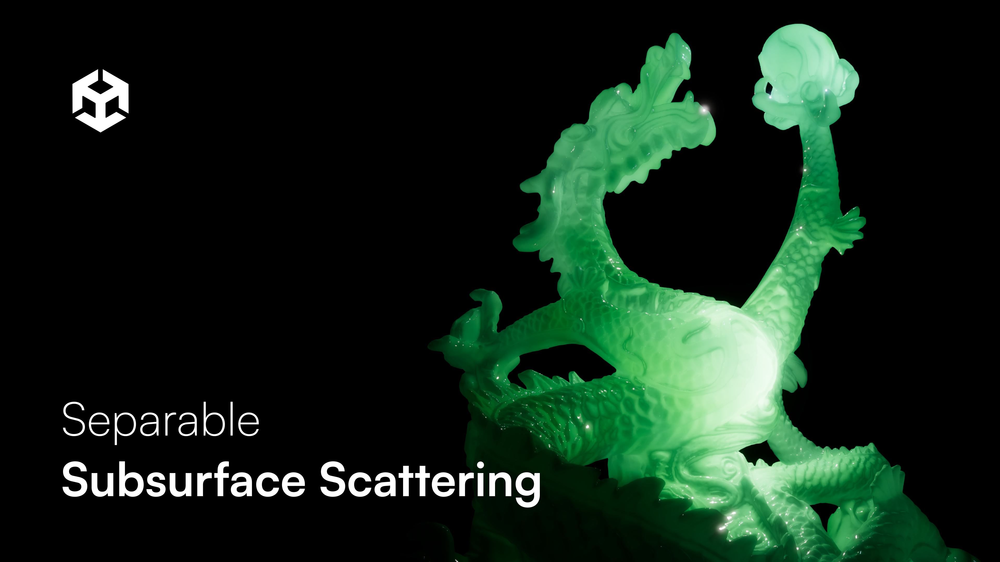

# Separable Subsurface Scattering in Unity 6

This repository contains the source code for my implementation of Separable Subsurface Scattering in Unity 6 URP. The project separates diffuse, specular, and ambient lighting into multiple render targets, applies a separable blur to the diffuse lighting, and composites the result back into the final image.

## Technical Devlog

For the full technical breakdown, including the Render Graph setup, shader pipeline, masking approach, limitations, and material showcase, **[read the full devlog](https://bentobaux.github.io/posts/separable-subsurface-scattering-in-unity-6/)**
